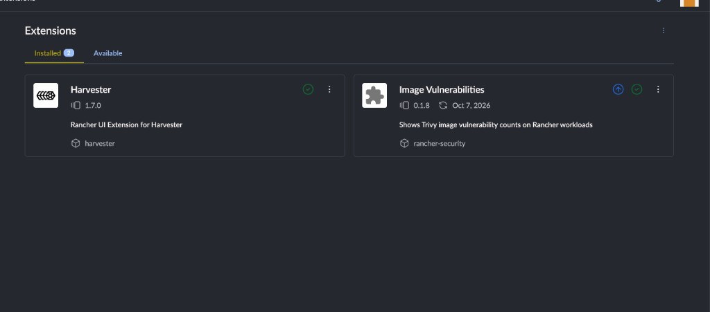
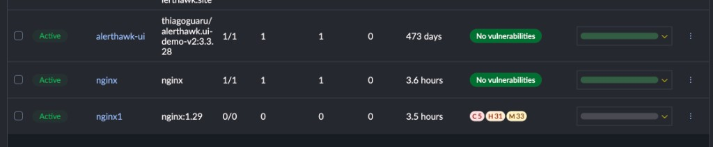
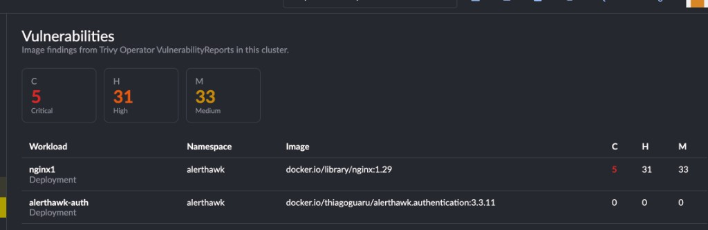

# Image Vulnerabilities for Rancher

Rancher UI extension that shows image vulnerability counts on workload lists. It targets Rancher 2.10 or newer.

The extension does not scan images. [Trivy Operator](https://github.com/aquasecurity/trivy-operator) scans the cluster and writes `VulnerabilityReport` resources. This extension reads those reports through the Kubernetes API that Rancher already proxies.

## How it works

Workload tables get a **Vulns** column. That includes Deployments, DaemonSets, StatefulSets, ReplicaSets, Jobs, CronJobs, and Pods. Pods show the scan of the ReplicaSet, StatefulSet, DaemonSet, or Job that owns them.

The column shows critical, high, and medium counts. A scan with none of those findings shows a green **No vulnerabilities** pill. Low and unknown findings are left out. Click a cell to open the CVE list for that image.

Cluster Explorer also has **Container Security → Vulnerabilities**, with totals for the current namespace filter and the same workloads.

A browser refresh loads the latest `VulnerabilityReport` objects. It does not start a new Trivy scan. Trivy Operator updates reports on its own schedule.

## Screenshots

The extension installed from the Rancher Extensions page:



The **Vulns** column on a workload list. Clean images show the green pill. Images with findings show critical, high, and medium counts:



**Container Security → Vulnerabilities** in Cluster Explorer:



## Install Trivy Operator

Trivy Operator is required. Without it, the column stays empty because there are no `VulnerabilityReport` resources to read.

```bash
helm repo add aqua https://aquasecurity.github.io/helm-charts/
helm repo update
helm install trivy-operator aqua/trivy-operator \
  --namespace trivy-system \
  --create-namespace \
  --version 0.37.0
```

This is my yaml settings, I changed **targetNamespaces**, **scanJobsConcurrentLimit** to 1, and **ignoreUnfixed** (true)

```
affinity: {}
alternateReportStorage:
  enabled: false
  mountPath: /mnt/data/trivy-operator
  podSecurityContext:
    fsGroup: 10000
    runAsUser: 10000
  storage: 10Gi
  storageClassName: ''
  volumeName: trivy-operator-pvc
automountServiceAccountToken: true
compliance:
  cron: 0 */6 * * *
  failEntriesLimit: 10
  reportType: summary
  specs:
    - k8s-cis-1.23
    - k8s-nsa-1.0
    - k8s-pss-baseline-0.1
    - k8s-pss-restricted-0.1
excludeNamespaces: ''
extraEnv: []
fullnameOverride: ''
global:
  image:
    registry: ''
  cattle:
    systemProjectId: p-255f7
hostAliases: []
image:
  pullPolicy: IfNotPresent
  pullSecrets: []
  registry: mirror.gcr.io
  repository: aquasec/trivy-operator
  tag: ''
managedBy: Helm
nameOverride: ''
nodeCollector:
  excludeNodes: null
  imagePullSecret: null
  registry: ghcr.io
  repository: aquasecurity/node-collector
  tag: 0.3.1
  tolerations: []
  useNodeSelector: true
  volumeMounts:
    - mountPath: /var/lib/etcd
      name: var-lib-etcd
      readOnly: true
    - mountPath: /var/lib/kubelet
      name: var-lib-kubelet
      readOnly: true
    - mountPath: /var/lib/kube-scheduler
      name: var-lib-kube-scheduler
      readOnly: true
    - mountPath: /var/lib/kube-controller-manager
      name: var-lib-kube-controller-manager
      readOnly: true
    - mountPath: /etc/systemd
      name: etc-systemd
      readOnly: true
    - mountPath: /lib/systemd/
      name: lib-systemd
      readOnly: true
    - mountPath: /etc/kubernetes
      name: etc-kubernetes
      readOnly: true
    - mountPath: /etc/cni/net.d/
      name: etc-cni-netd
      readOnly: true
  volumes:
    - hostPath:
        path: /var/lib/etcd
      name: var-lib-etcd
    - hostPath:
        path: /var/lib/kubelet
      name: var-lib-kubelet
    - hostPath:
        path: /var/lib/kube-scheduler
      name: var-lib-kube-scheduler
    - hostPath:
        path: /var/lib/kube-controller-manager
      name: var-lib-kube-controller-manager
    - hostPath:
        path: /etc/systemd
      name: etc-systemd
    - hostPath:
        path: /lib/systemd
      name: lib-systemd
    - hostPath:
        path: /etc/kubernetes
      name: etc-kubernetes
    - hostPath:
        path: /etc/cni/net.d/
      name: etc-cni-netd
nodeSelector: {}
operator:
  accessGlobalSecretsAndServiceAccount: true
  annotations: {}
  batchDeleteDelay: 10s
  batchDeleteLimit: 10
  builtInServerRegistryInsecure: false
  builtInTrivyServer: false
  cacheReportTTL: 120h
  clusterComplianceEnabled: true
  clusterSbomCacheEnabled: false
  configAuditScannerEnabled: true
  configAuditScannerScanOnlyCurrentRevisions: true
  controllerCacheSyncTimeout: 5m
  exposedSecretScannerEnabled: true
  httpProxy: null
  httpsProxy: null
  infraAssessmentScannerEnabled: true
  labels: {}
  leaderElectionId: trivyoperator-lock
  logDevMode: false
  mergeRbacFindingWithConfigAudit: false
  metricsClusterComplianceInfo: false
  metricsConfigAuditInfo: false
  metricsExposedSecretInfo: false
  metricsFindingsEnabled: true
  metricsImageInfo: false
  metricsInfraAssessmentInfo: false
  metricsRbacAssessmentInfo: false
  metricsVulnIdEnabled: false
  namespace: ''
  noProxy: null
  podLabels: {}
  pprofBindAddress: ''
  privateRegistryScanSecretsNames: {}
  rbacAssessmentScannerEnabled: true
  replicas: 1
  revisionHistoryLimit: null
  sbomGenerationEnabled: true
  scanJobTTL: ''
  scanJobTimeout: 5m
  scanJobsConcurrentLimit: 1
  scanJobsRetryDelay: 30s
  scanNodeCollectorLimit: 1
  scanSecretTTL: ''
  scannerReportTTL: 24h
  serverAdditionalAnnotations: {}
  trivyServerHealthCheckCacheExpiration: 10h
  valuesFromConfigMap: ''
  valuesFromSecret: ''
  vulnerabilityScannerEnabled: true
  vulnerabilityScannerScanOnlyCurrentRevisions: true
  webhookBroadcastCustomHeaders: ''
  webhookBroadcastTimeout: 30s
  webhookBroadcastURL: ''
  webhookSendDeletedReports: false
podAnnotations: {}
podSecurityContext: {}
policiesBundle:
  existingSecret: false
  insecure: false
  registry: mirror.gcr.io
  registryPassword: null
  registryUser: null
  repository: aquasec/trivy-checks
  tag: 1
priorityClassName: ''
rbac:
  create: true
resources: {}
securityContext:
  allowPrivilegeEscalation: false
  capabilities:
    drop:
      - ALL
  privileged: false
  readOnlyRootFilesystem: true
service:
  annotations: {}
  headless: true
  metricsAppProtocol: TCP
  metricsPort: 80
  nodePort: null
  type: ClusterIP
serviceAccount:
  annotations: {}
  create: true
  name: ''
serviceMonitor:
  annotations: {}
  enabled: false
  endpointAdditionalProperties: {}
  honorLabels: true
  interval: null
  labels: {}
  namespace: null
targetNamespaces: >-
  alerthawk,traefik,clickhouse,cert-manager,cattle-system
targetWorkloads: pod,replicaset,replicationcontroller,statefulset,daemonset,cronjob,job
tolerations: []
trivy:
  additionalVulnerabilityReportFields: ''
  clientServerSkipUpdate: false
  command: image
  configFile: null
  createConfig: true
  dbRegistry: mirror.gcr.io
  dbRepository: aquasec/trivy-db
  dbRepositoryInsecure: 'false'
  dbRepositoryPassword: null
  dbRepositoryUsername: null
  debug: false
  existingSecret: false
  externalRegoPoliciesEnabled: false
  filesystemScanCacheDir: /var/trivyoperator/trivy-db
  githubToken: null
  httpProxy: null
  httpsProxy: null
  ignoreFile: null
  ignoreFileName: ''
  ignoreUnfixed: true
  image:
    imagePullSecret: null
    pullPolicy: IfNotPresent
    registry: mirror.gcr.io
    repository: aquasec/trivy
    tag: 0.75.0
  imageScanCacheDir: /tmp/trivy/.cache
  includeDevDeps: false
  insecureRegistries: {}
  javaDbRegistry: mirror.gcr.io
  javaDbRepository: aquasec/trivy-java-db
  labels: {}
  mode: Standalone
  noProxy: null
  nonSslRegistries: {}
  offlineScan: false
  podLabels: {}
  priorityClassName: ''
  registry:
    mirror: {}
  resources:
    limits:
      cpu: 500m
      memory: 500M
    requests:
      cpu: 100m
      memory: 100M
  sbomSources: ''
  server:
    extraServerVolumes:
      volumeMounts: []
      volumes: []
    podSecurityContext:
      fsGroup: 65534
      runAsNonRoot: true
      runAsUser: 65534
    replicas: 1
    resources:
      limits:
        cpu: 1
        memory: 1Gi
      requests:
        cpu: 200m
        memory: 512Mi
    securityContext:
      privileged: false
      readOnlyRootFilesystem: true
  serverCustomHeaders: null
  serverInsecure: false
  serverPassword: ''
  serverServiceName: trivy-service
  serverToken: null
  serverTokenHeader: Trivy-Token
  serverUser: ''
  severity: MEDIUM,HIGH,CRITICAL
  skipDirs: null
  skipFiles: null
  skipJavaDBUpdate: false
  slow: true
  sslCertDir: null
  storageClassEnabled: true
  storageClassName: ''
  storageSize: 5Gi
  supportedConfigAuditKinds: >-
    Workload,Service,Role,ClusterRole,NetworkPolicy,Ingress,LimitRange,ResourceQuota,PersistentVolume,PersistentVolumeClaim
  timeout: 5m0s
  useBuiltinRegoPolicies: 'false'
  useEmbeddedRegoPolicies: 'true'
  valuesFromConfigMap: ''
  valuesFromSecret: ''
  vulnType: null
trivyOperator:
  additionalReportLabels: ''
  configAuditReportsPlugin: Trivy
  excludeImages: ''
  metricsResourceLabelsPrefix: k8s_label_
  policiesConfig: ''
  reportRecordFailedChecksOnly: true
  reportResourceLabels: ''
  scanJobAffinity: {}
  scanJobAnnotations: ''
  scanJobAutomountServiceAccountToken: false
  scanJobCompressLogs: true
  scanJobCustomVolumes: []
  scanJobCustomVolumesMount: []
  scanJobNodeSelector: {}
  scanJobPodPriorityClassName: ''
  scanJobPodTemplateContainerSecurityContext:
    allowPrivilegeEscalation: false
    capabilities:
      drop:
        - ALL
    privileged: false
    readOnlyRootFilesystem: true
  scanJobPodTemplateLabels: ''
  scanJobPodTemplatePodSecurityContext: {}
  scanJobTolerations: []
  scanJobsInSameNamespace: false
  skipInitContainers: false
  skipResourceByLabels: ''
  useGCRServiceAccount: true
  vulnerabilityReportsPlugin: Trivy
volumeMounts:
  - mountPath: /tmp
    name: cache-policies
    readOnly: false
volumes:
  - emptyDir: {}
    name: cache-policies
```

Point `kubectl` and Helm at the cluster you want scanned. The chart scans workloads in all namespaces by default.

Check whether an operator is already installed before running that command:

```bash
kubectl get deploy -A | grep trivy
```

## Install the extension

1. In Rancher, open **Extensions**.
2. Open the menu at the top right and choose **Manage Repositories**.
3. Add a repository with this Helm index URL:

   ```text
   https://thiagoloureiro.github.io/rancher-security-chart/
   ```

4. Open the **Available** tab and install **Image Vulnerabilities**.
5. Reload the browser.

The **Vulns** column appears on workload lists, and **Container Security → Vulnerabilities** appears in Cluster Explorer.

## Develop

Use Node.js 24.

```bash
nvm use
yarn install
API=https://<your-rancher> yarn dev
```

Open https://127.0.0.1:8005 and sign in. The extension loads into the development UI automatically.

```bash
yarn test
```
